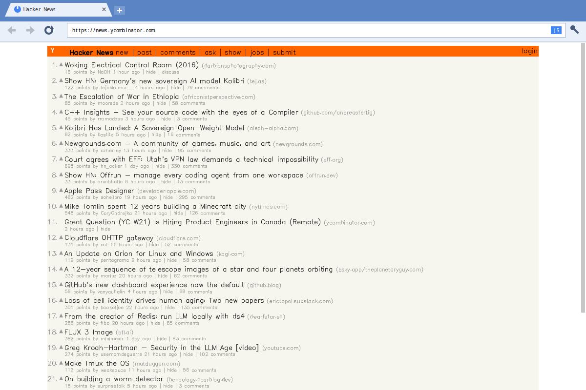
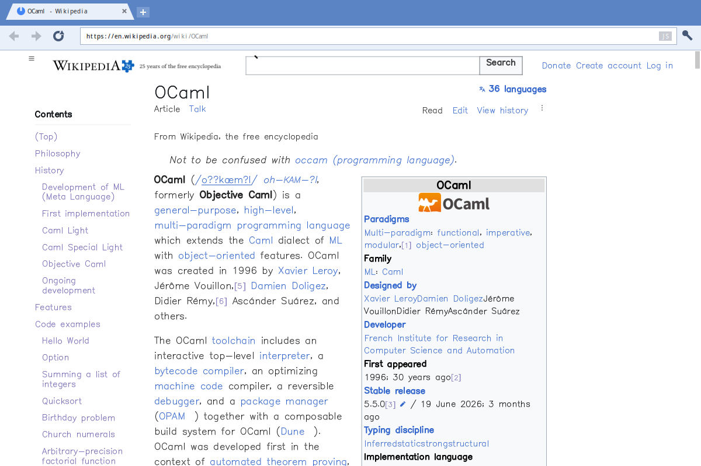
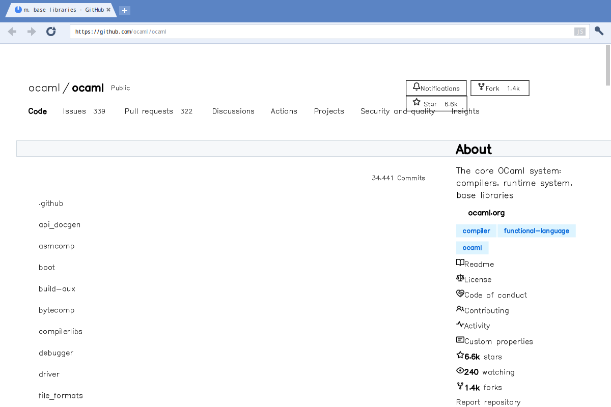
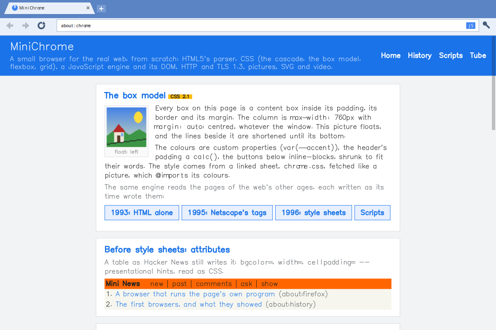
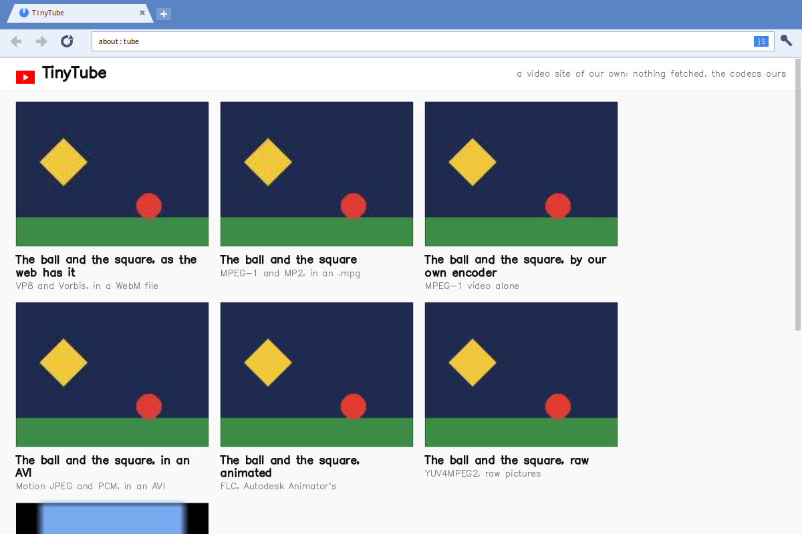
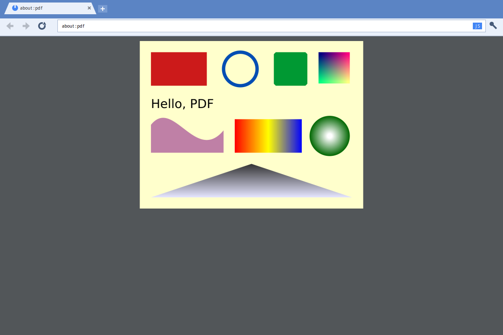
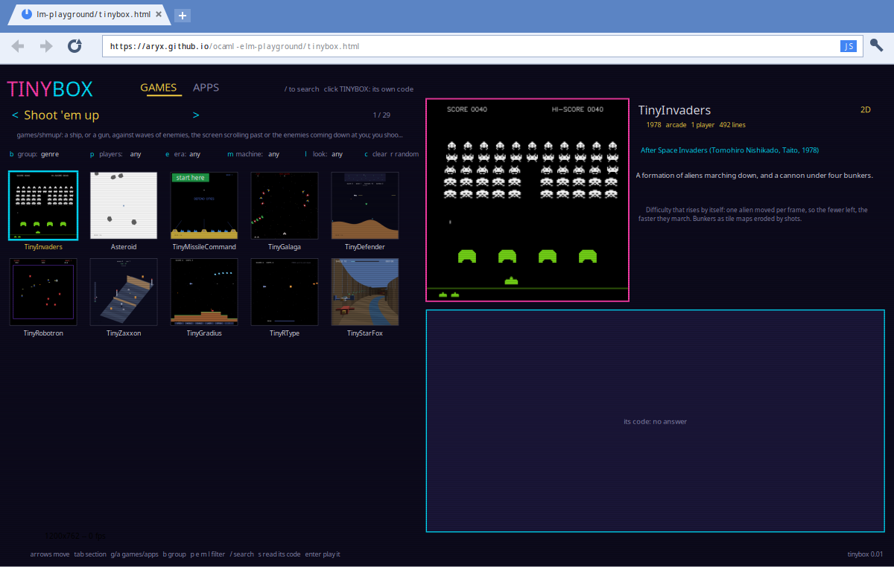
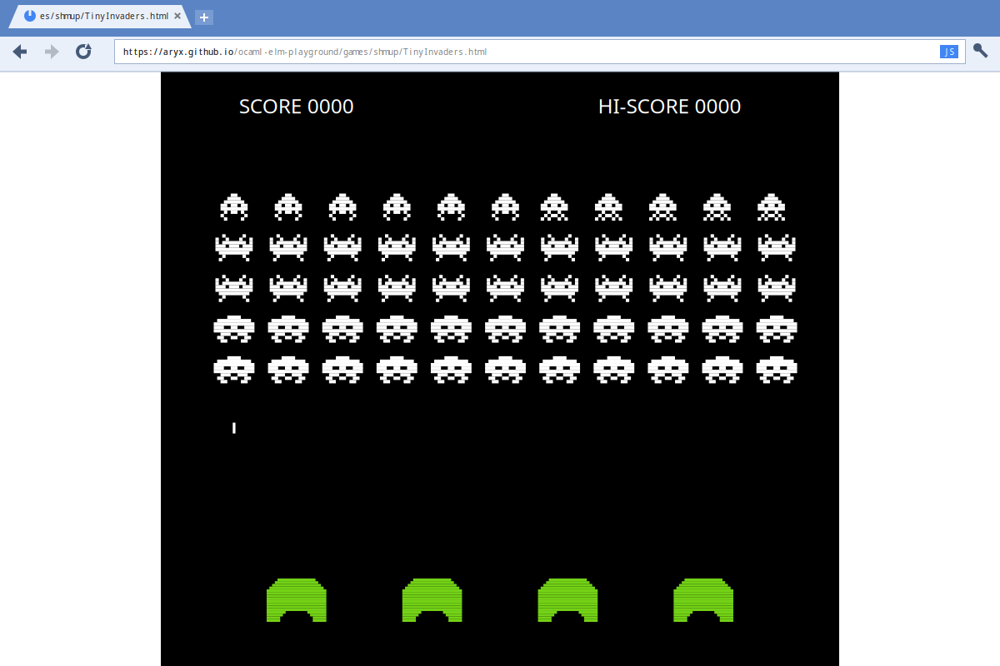
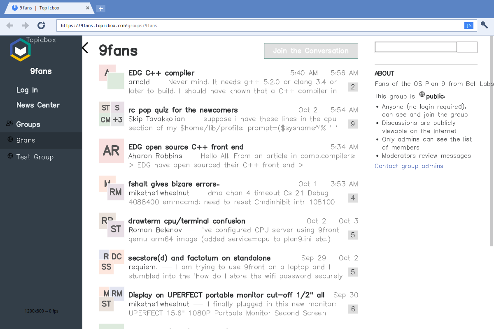
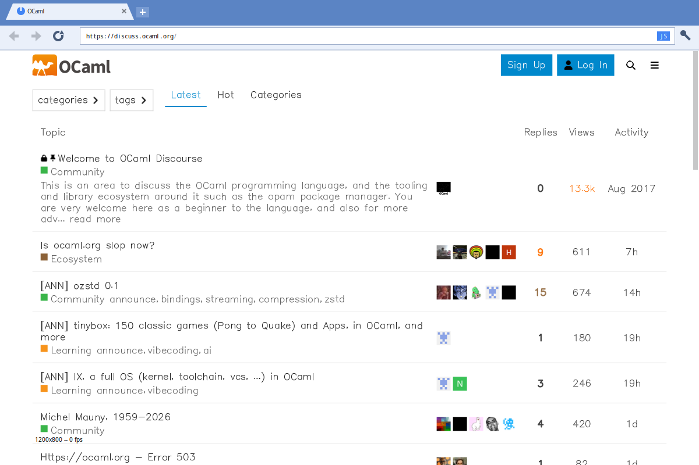

# mini-chrome

A small web browser written from scratch in OCaml, after Google Chrome
(2008). It reads the three languages a page is written in -- HTML,
CSS and JavaScript -- and, since a browser is also everything a page
may point to, it has its own network stack, its own decoders of
pictures, video and sound, and a PDF viewer.

| | | |
|---|---|---|
| <a href="docs/screenshots/hackernews.png"></a> | <a href="docs/screenshots/wikipedia.png"></a> | <a href="docs/screenshots/github.png"></a> |
| Hacker News | Wikipedia, an article | GitHub, a repository |
| <a href="docs/screenshots/chrome.png"></a> | <a href="docs/screenshots/tube.png"></a> | <a href="docs/screenshots/pdf.png"></a> |
| `about:chrome`: what the engine does, a card each | `about:tube`: every kind of media it plays | `about:pdf`: a PDF file in a tab |
| <a href="docs/screenshots/tinybox.png"></a> | <a href="docs/screenshots/invaders.png"></a> | |
| [tinybox](https://aryx.github.io/ocaml-elm-playground/tinybox.html): the Playground's menu, OCaml compiled to JavaScript, run by our engine | one of its games, opened from the menu and played | the Playground draws the browser that runs the Playground |
| <a href="docs/screenshots/9fans.png"></a> | <a href="docs/screenshots/discourse.png"></a> | |
| [9fans](https://9fans.topicbox.com/groups/9fans) on Topicbox: a page of 3 KB and 600 KB of scripts that draw the rest | [discuss.ocaml.org](https://discuss.ocaml.org): Discourse, 4 MB of Ember run by our engine (half a minute to start) | |

(The pictures are the real program's, on the real sites:
`scripts/sites/screenshots.sh` takes them again.)

What is in it:

- **A page.** HTML read as browsers read it (tags left open, tables,
  forms); CSS: the cascade, the box model, floats, tables, flexbox and
  grid; a JavaScript engine (classes, closures, promises and async
  functions, modules, regular expressions) with the web APIs a script
  expects: the DOM and its events, `fetch` and `XMLHttpRequest` under
  the same-origin policy and CORS, `WebSocket`, timers and the event
  loop, `localStorage`.
- **The network.** HTTP/1.1 over its own TLS 1.3 client (X.509
  certificates checked), cookies, WebSocket; bodies in gzip, Brotli
  and Zstandard.
- **Pictures.** PNG, WebP (lossy and lossless) and SVG, written or
  kept here as the web's own formats; GIF and JPEG.
- **Video and sound.** `<video>` and `<audio>`: WebM with VP8, and
  its sound in Vorbis or Opus; also MPEG-1, MP3, WAV, MIDI and a few
  older ones. `about:tube` plays one of each.
- **Documents.** A PDF file opens in a tab, drawn with the fonts it
  carries (TrueType, CFF, Type 1), its pictures and gradients
  (`about:pdf`).
- **The browser around the page.** Tabs, the omnibox (an address or a
  search), Back and Forward with the pages kept as they were, zoom by
  site, a profile and its cookies, a right click's menu, and developer
  tools: the page's tree and styles, the requests it made.
- **Small programs beside it**, made of the same libraries:
  `mini-node` (the JavaScript engine in a terminal), `mini-curl`,
  `mini-httpd`, `mini-lynx` (a page as text), and three older
  browsers, `mini-mosaic`, `mini-netscape` and `mini-firefox`, over
  the first layout engine.

From scratch all the way down. What the web itself brought is written
or told here -- the languages, the network and TLS, WebP, PNG, SVG,
WebM and VP8, Vorbis, Opus, Brotli, PDF and its fonts. The rest is
[elm-playground](https://github.com/aryx/ocaml-elm-playground)'s,
written from scratch as well: the window and the drawing (by Cairo,
or by its own software rasterizer if you like), the cryptography,
JPEG, GIF, MP3 and MPEG-1, the letters (one stroke font).
[docs/dependencies.md](docs/dependencies.md) says exactly what comes
from where. Of C it needs only SDL, for the window.

Small enough to read: about 36,000 lines of OCaml for the browser
itself, kept under a budget of 40,000 (`make loc`), not counting what
each module's interface says about itself.

It started as elm-playground's TinyChrome. That repository holds a
program to 5,000 lines of its own code, and TinyChrome was already
well past that once its engine, kept in the libraries beside it, was
counted; here it grows, towards the web as it is.
[docs/sites.md](docs/sites.md) says where it stands on real sites,
part by part: Hacker News, Wikipedia and GitHub read well, GitHub
with its scripts running (React over the server's page), as do two
applications that are all scripts (Discourse, Topicbox); the BBC is
readable but not right, and YouTube does not work yet.

All of the code was written by an AI, Claude Code, under the author's
direction (see the [AI disclaimer](#ai-disclaimer)), but it was written
for people to read, and checked by tests: each module's interface opens
with what it is, where it came from and what to read, the web's history
told module by module -- the omnibox, the cascade, CORS, the event
loop, Vorbis, the range coder of Opus, a PDF's fonts. Judge it by what
it explains, as you would a textbook's.

## Building

It stands on elm-playground's packages: the Playground for its window
and drawing, on one of its two native platforms (SDL for the window
either way, and Cairo, `elm_playground_native`, or the Playground's
own rasterizer, `elm_playground_software`), and `tiny_libs` for the
cryptography, the compressions and the decoders that are not the
web's own.

```bash
./configure    # the opam dependencies, and checks for SDL2 and Cairo
make
make test
```

`./configure --software` leaves Cairo out altogether, as it does by
itself when Cairo is not found.

It builds with OCaml 4.14 and with OCaml 5, and **OCaml 5 is the one
to use**: the same source, but there the pool that fetches, decrypts,
decompresses and decodes pictures is made of domains, which run
beside the window on the machine's other cores, where 4.14's threads
take turns on one. GitHub's repository page with its scripts on comes
whole in 12 s with OCaml 5.5.1 and in 25 with 4.14.

```bash
opam switch create 5.5.1 && eval $(opam env --switch=5.5.1)
```

Working on both repositories side by side, install elm-playground's
packages from its checkout into your switch instead (again whenever
mini-chrome should see a change there), then build here:

```bash
(cd ../ocaml-elm-playground && make && make install)
./configure
make
```

Then `./bin/mini-chrome` (a symlink into `_build`, alive after a
`make`), or `make run`; with an address, `./bin/mini-chrome
news.ycombinator.com`, that page (several: a tab each; words that are
not an address are searched): drawn by Cairo when its platform is installed,
else by the Playground's own rasterizer. `./bin/mini-chrome-software`
(`make run-software`) is always the latter, for comparison.

## Flags

A word of the command line that is not a flag is a page to open. The
program's flags are `key=value` words:

| Flag | What it does |
|---|---|
| `url=ADDRESS` | the first page (`about:chrome` without) |
| `scripts=off`, `scripts=HOST1,HOST2` | no site's scripts run, or those of these hosts alone (every site's by default; a click on the omnibox's "JS" turns them all off and on) |
| `css=off` | no style sheet but the browser's own |
| `panel=elements`, `panel=network` | the developer tools, open |
| `search=duckduckgo` | where the omnibox sends words |
| `profile=DIR`, `profile=off` | another profile's directory, or none read or written |
| `scale=N` | everything drawn N times bigger (the desktop's scale without) |
| `cache=off` | no answer kept on disk, nor read from it (`about:cache` shows what is) |
| `threads=off` | no thread: a fetch waits, a script's long run freezes the window |
| `timings=on` | where the time went, by stage, said when the program ends (`Stopwatch`) |
| `opti=off` | the simple code, where an optimized one replaced it |
| `js=walk` | a script's functions walked by the evaluator, not compiled |
| `letters=segments` | a letter drawn as its pen's strokes |
| `pdf=strokes`, `pdf=plain` | a PDF's text in our own letters; its simplest rendering |

The end of the tab strip says which build is running ("OCaml 5.5.1,
8 domains"), and `about:version` the rest.

The Playground's own flags start with a dash: `-v` shows each file
and URL opened and what a page's scripts say on their console
(`-debug` more, `-quiet` nothing); `-size WxH`, `-dump-frame N
FILE.png` and `-script` run it without a screen, to a picture
(CLAUDE.md says how).

## Using it

Ctrl+Q quits (with elm-playground after 0.3.1; with 0.3.1 a plain `q`
does, wherever it is typed).

The omnibox is a line of text as any other: a click selects the
address, then a click puts the caret and a drag selects; Ctrl+A, C, X
and V, with the desktop's clipboard. The pointer is a hand over a
link.

A page longer than the window has a scrollbar at its right: drag its
thumb, or click above or below it for a page.

A right click on the page opens a menu: on a link, Open link in new
tab; elsewhere Back, Forward, Reload; Inspect in both.

On a screen of many dots everything is drawn bigger, at the desktop's
scale (`Xft.dpi`, GNOME's setting: twice at 192); Ctrl+Shift and `+` or
`-` change it, Ctrl+Shift+`0` goes back to the desktop's, `scale=N`
sets it.

Ctrl and `+`, `-` or the wheel zoom the page, Ctrl and `0` back to
100%; each site keeps its zoom, saved with the window's size in the
profile (`~/.config/mini-chrome/Preferences`, JSON).

What the browser does not show itself can be given to a program of
yours, as Mosaic gave PostScript to ghostview: its "helper
applications". They are written by hand in the profile's
`Preferences`, and none is there until you do:

```json
{
  "helpers": [
    { "site": "youtube.com/watch", "run": ["mpv", "%u"] },
    { "type": "application/postscript", "run": ["gv", "%f"] }
  ]
}
```

A rule for a site (a host, and what the path begins with) adds "Open
with mpv" to the right click's menu, on that page and on a link to
it; the program is given the address (`%u`). A rule for a content
type has a page of that type written to a file (`%f`) and the program
run on it. YouTube's videos are played that way: the browser shows
the site, its search and a video's page, and cannot play the film
itself.

## Layout

After [mmm](https://github.com/aryx/mmm)'s: the languages a page is
written in, general libraries, then the browser by role, each folder a
library, in the order they depend on each other:

```
libs/dom              the document as a tree (Dom): what HTML and XML are
                      read into, what CSS matches on and the rest walks
languages/html        HTML read: bytes to text, tokens, the tree
languages/xml         XML read into the same tree (Xml): an SVG file
languages/css         style sheets read and cascaded, computed styles
languages/javascript  a small JavaScript, with modules (Js_module) and
                      the later library written in itself (Js_prelude)
languages/json        JSON read and written, over JavaScript's lexer
libs/gui              the chrome's pieces that know no browser, as values
                      drawn and asked what is under a point: text in
                      cells (Gui_text), the tabs' strip (Gui_tabs), the
                      toolbar's buttons (Gui_toolbar), a menu opened at
                      a point (Gui_menu), a line typed into (Gui_field),
                      a scrollbar (Gui_scrollbar), the desktop's scale
                      (Gui_scale)
libs/compression      Brotli, the web's own compression (Content-
                      Encoding: br), decoded, with its dictionary of
                      the web's words; gzip and Zstandard are
                      elm-playground's
libs/images           the picture formats born of the web. PNG (Png:
                      filters, DEFLATE, Adam7). WebP, in webp/: the
                      file's chunks (Webp), the lossless format
                      (Vp8l), the lossy one, a key frame of the VP8
                      video codec (Vp8). SVG made pixels (Svg: paths, shapes,
                      fills and strokes; from an <svg> of a page or a
                      file, one tree). GIF and JPEG are
                      elm-playground's
libs/video            video as the web has it: a WebM file's frames found
                      (Webm) and decoded (Vp8_video: VP8's frames
                      predicted from others, over libs/images' Vp8);
                      what <video> plays of today's web
libs/audio            sound as the web has it: Vorbis decoded (Vorbis:
                      codebooks, floors, residues), an Ogg file's
                      packets (Ogg), and Opus where it is music (opus/: Opus;
                      Celt: each band's energy, then its shape as
                      pulses; Range_decoder; Mdct, both codecs'
                      transform): a WebM's sound, and <audio>'s
libs/fonts            outline fonts read: a glyph's contours (Outline) from
                      TrueType, CFF and Type 1 files; glyphs' names, the
                      standard fonts' widths
libs/pdf              a PDF file read (Pdf: objects, the table of where
                      they are, filters, the page tree) and a page drawn
                      (Pdf_render: paths, text in the file's own fonts or
                      in ours, pictures, clips, gradients, transparency)
libs/opti             the switch between an optimized function and the
                      simple one kept beside it (Mini_opti; opti=off)
libs/richtext         a look (Style): what the pen drawing a letter is told
libs/network          URLs, HTTP/1.1, cookies, TLS 1.3 and the sockets: a
                      GET that never blocks, stepped each frame
                      (Http_request); WebSocket, its handshake and
                      frames (Websocket) and a connection stepped
                      each frame (Websocket_client)
src/url/              links resolved (Browser_url)
src/layout/           where everything goes: CSS's box model (Box_layout,
                      over Box_tree, Box_inline and Box_flow), flexbox,
                      grid (Box_grid, Grid_layout), tables, Mosaic's flow; a point back to a link (Hit)
src/display/          a page drawn as shapes: Hershey's letters (and those
                      with an accent, put together: Glyph_unicode), pictures,
                      boxes (Browser_draw, Browser_boxes)
src/www/              the page as a document (Browser_page), its forms
src/webapi/           the web APIs, JavaScript in a browser (in dom/, net/,
                      window/, run/): the DOM a page's scripts
                      see (Script_dom, Script_host, Script_element,
                      Script_events, Script_document), window's globals
                      (Script_window), a script asking the network
                      (XMLHttpRequest, Script_fetch, WebSocket), a
                      page's modules (Script_modules) and their tasks (Browser_script:
                      the scripts, the events, the timers)
src/viewers/          <video> and <audio> (Browser_media, Media); a PDF
                      file as a page of pictures (Pdf_viewer)
src/about/            the about: pages, the built-in site and about:tube
src/chrome/           a tab (Browser_tab), its requests in flight (Fetch),
                      the history, the developer tools, each site's zoom
                      (Browser_zoom), what the right click's menu offers
                      (Browser_menu), what is kept between runs
                      (Browser_profile), what it says it is to each
                      site (Browser_agent)
src/window/           the window as a Model-View-Update program over
                      those and libs/gui's pieces: Window_model (the
                      state, the messages), Window_layout (where each
                      part is, what is under the pointer), Window_tabs
                      (a tab changed, opened, closed; scroll, zoom),
                      Window_update, Window_view
src/main/             the main: the flags, the profile, the capabilities
                      handed down, the Playground run (MiniChrome.ml)
tools/                small programs beside the browser, made of its
                      libraries, for teaching:
                      node   mini-node: JavaScript outside a browser, the
                             same engine with a terminal for host (console,
                             process, timers and their loop, require, fs)
                      curl   mini-curl: a URL fetched and printed, by our
                             own HTTP, TLS, gzip and cookies (-v, -i, -L)
                      httpd  mini-httpd: a directory's files served, the
                             other end of the conversation; a
                             WebSocket asked for is an echo
                      lynx   mini-lynx: a page as text in the terminal,
                             its links numbered, a number typed to follow
                      mosaic    mini-mosaic: NCSA Mosaic, 1993 -- and the
                                web's first layout engine, the browser's
                                until CSS's replaced it: a look for each
                                element from a table (Mosaic_looks),
                                blocks and lines in one pass
                                (Mosaic_layout), drawn (Mosaic_draw)
                      netscape  mini-netscape: Netscape, 1994-1997: the
                                same engine with its extensions (fonts,
                                colours, floats, tables) and CSS1
                      firefox   mini-firefox: 2004: the same again, and
                                the page's scripts, a console, the tree
                      typeset   lines broken by Knuth and Plass
                                (mini-mosaic's wrap=pretty)
                      platform  the window the three are linked with
tests/                tools, html, xml, css, js, layout, browser, images, video, audio, pdf, compression, network, network_unix
docs/                 architecture.md: the running program's shape (the
                      loop, the chrome's pieces, its one process and
                      threads next to Chrome's); dependencies.md: what
                      it stands on outside this repository, by kind;
                      history.md: how it came to be; sites.md: the sites it shows, and
                      what each lacks, by part, in colours; tags.md:
                      the theme tags of the interfaces' comments
                      (cs-history:, modern:...)
docs/tutorials/       a browser built stage by stage: notes_browser.md,
                      notes_css_engine.md, notes_javascript.md,
                      notes_tls.md
docs/plans/           what is being done: plan_performance.md (where a
                      load's time goes, what to change); done/: the
                      plans the tutorials followed (plan_browser_teaching,
                      plan_tiny_firefox, plan_tiny_chrome: the target
                      sites)
docs/related-work/    notes_browser_related_work.md: the browsers since
                      1990, and where this one stands
docs/dev/             notes_debugging_techniques.txt: how a page that
                      looks wrong, or slow, was looked into
scripts/              perf/: a page's stages timed (Page_bench), a load
                      in time (load_timeline.sh); sites/: the sites of
                      docs/sites.md dumped, the README's screenshots taken
data/                 what is embedded and is not OCaml (data/README.md):
                      about/ the built-in site's pages, sheets, scripts,
                      pictures and a sample PDF; tube/ about:tube's files
                      made elsewhere (ffmpeg, LAME); css/ua.css the
                      browser's own style sheet; prelude/ the library
                      and the small web APIs written in JavaScript
```

## AI disclaimer

mini-chrome was written by Claude Code: the code, the tests, the
comments and the documents in `docs/`. I (Pad) chose what to build,
directed it and reviewed it, but wrote almost none of the code myself.
So was TinyChrome, the program of elm-playground it was forked from,
and so are the libraries of elm-playground it stands on (`tiny_libs`:
the decoders, the cryptography; that repository's README says what
there is Evan Czaplicki's, mine and Claude's).

It is a browser to read and to learn from, not one to trust with your
passwords or your bank: its TLS, its cryptography and its JavaScript
engine were written for teaching and have had no security review.

## License

LGPL 2.1 (see LICENSE), as elm-playground.
